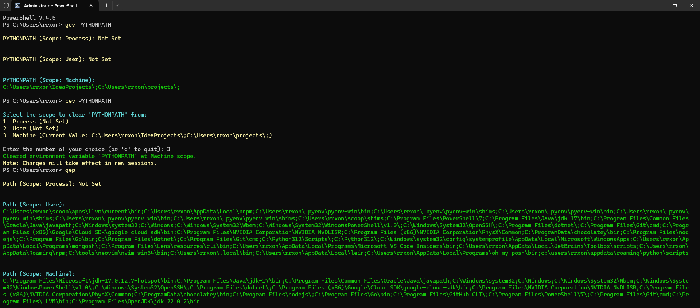

# Environment Variable Manager PowerShell 🛠️



## 📘 Introduction

This repository contains the PowerShell script **`env-manager.ps1`**, which provides enhanced functions to facilitate the management of environment variables on Windows. These functions allow you to **get**, **set**, **clear**, and **remove** environment variables in an interactive and intuitive way, supporting different scopes (**Process**, **User**, and **Machine**), and feature a colorful interface for better visualization.

## 🚀 Features

- **Get Environment Variables**: View the value of an environment variable in all scopes.
- **Set Environment Variables**: Configure or update environment variables with interactive scope selection.
- **Clear Environment Variables**: Clear the value of an environment variable in a specific scope.
- **Remove Environment Variables**: Completely remove an environment variable from a specific scope.
- **PATH Management**: Add or remove directories from the `PATH` with scope interaction.
- **Colorful Interface**: Uses colors to highlight important information, success messages, warnings, and errors.
- **Immediate Update**: Changes reflect immediately in the current PowerShell session.

## 📥 Installation

1. **Clone the Repository**:

    ```powershell
    git clone https://github.com/your-username/your-repository.git
    ```

2. **Open Your PowerShell Profile**:

    The PowerShell profile is a script that runs whenever you open a new PowerShell session. To edit your profile:

    ```powershell
    notepad $PROFILE
    ```

    If the file doesn't exist, you'll be prompted to create one.

3. **Add the Script to Your Profile**:

    Copy the entire content of the **`env-manager.ps1`** script from this repository and paste it into your profile file opened in Notepad.

4. **Save and Close Notepad**.

5. **Reload Your Profile**:

    To apply the changes without restarting PowerShell:

    ```powershell
    . $PROFILE
    ```

## 🛠️ Usage

The functions are accessible through **aliases** for ease of use. Below are the available aliases and how to use them:

### 📜 Available Aliases

| Alias | Function           |
|-------|--------------------|
| `gev` | `Get-EnvVar`       |
| `sev` | `Set-EnvVar`       |
| `cev` | `Clear-EnvVar`     |
| `rev` | `Remove-EnvVar`    |
| `gep` | `Get-EnvPath`      |
| `aep` | `Add-EnvPath`      |
| `rep` | `Remove-EnvPath`   |

### 🔍 Get an Environment Variable

To view the value of an environment variable in all scopes:

```powershell
gev <VariableName>
```

**Example**:

```powershell
gev PYTHONPATH
```

**Output**:

```
PYTHONPATH (Scope: Process):
C:\Users\rrxon\IdeaProjects\;C:\Users\rrxon\projects\;

PYTHONPATH (Scope: User):
C:\Users\rrxon\projects\;

PYTHONPATH (Scope: Machine):
Not Set
```

### 🛠️ Set or Update an Environment Variable

To set or update an environment variable with interactive scope selection:

```powershell
sev <VariableName> <Value>
```

**Example**:

```powershell
sev PYTHONPATH "C:\My\Python\Path"
```

**Interaction**:

```
Select the scope to set 'PYTHONPATH' in:
1. Process (Current Value: )
2. User (Current Value: )
3. Machine (Not Set)

Enter the number of your choice (or 'q' to quit): 2

Set environment variable 'PYTHONPATH' to 'C:\My\Python\Path' at User scope.
Note: Changes will take effect in new sessions.
```

### 🧹 Clear the Value of an Environment Variable

To clear the value of an environment variable in a specific scope:

```powershell
cev <VariableName>
```

**Example**:

```powershell
cev PYTHONPATH
```

**Interaction**:

```
Select the scope to clear 'PYTHONPATH' from:
1. Process (Current Value: C:\My\Python\Path)
2. User (Current Value: C:\My\Python\Path)
3. Machine (Not Set)

Enter the number of your choice (or 'q' to quit): 2

Cleared environment variable 'PYTHONPATH' at User scope.
Note: Changes will take effect in new sessions.
```

### 🗑️ Remove an Environment Variable

To completely remove an environment variable from a specific scope:

```powershell
rev <VariableName>
```

**Example**:

```powershell
rev PYTHONPATH
```

**Interaction**:

```
Select the scope to remove 'PYTHONPATH' from:
1. Process (Current Value: C:\My\Python\Path)
2. User (Current Value: C:\My\Python\Path)
3. Machine (Not Set)

Enter the number of your choice (or 'q' to quit): 2

Removed environment variable 'PYTHONPATH' from User scope.
Note: Changes will take effect in new sessions.
```

### 🔗 PATH Management

#### 🆙 Add Directories to PATH

To add directories to the `PATH`:

```powershell
aep -Paths "C:\My\Tools","C:\Other\Dir"
```

**Or, without specifying paths on the command line**:

```powershell
aep
```

**Interaction**:

```
Enter the directories to add to PATH (separated by semicolons): C:\My\Tools;C:\Other\Dir

Select the scope to add paths to 'PATH':
1. Process (Current PATH Length: 123)
2. User (Current PATH Length: 456)
3. Machine (Current PATH Length: 789)

Enter the number of your choice (or 'q' to quit): 2

Adding 'C:\My\Tools' to PATH.
Adding 'C:\Other\Dir' to PATH.
Updated PATH at User scope.
Note: Changes will take effect in new sessions.
```

#### 🛠️ Remove Directories from PATH

To remove directories from the `PATH`:

```powershell
rep -Paths "C:\My\Tools","C:\Other\Dir"
```

**Or, without specifying paths on the command line**:

```powershell
rep
```

**Interaction**:

```
Enter the directories to remove from PATH (separated by semicolons): C:\My\Tools;C:\Other\Dir

Select the scope to remove paths from 'PATH':
1. Process (Current PATH Length: 123)
2. User (Current PATH Length: 456)
3. Machine (Current PATH Length: 789)

Enter the number of your choice (or 'q' to quit): 2

Removing 'C:\My\Tools' from PATH.
Path 'C:\Other\Dir' was not found in PATH.
Updated PATH at User scope.
Note: Changes will take effect in new sessions.
```

### 🌈 Colors and Styles

The script uses colors to improve visualization and distinguish different types of messages:

- **Cyan**: Section titles and selection prompts.
- **Yellow**: Menu options and warnings.
- **Green**: Success messages and confirmations.
- **Red**: Errors and operation cancellations.

This makes it easier to quickly identify important information and actions performed by the script.

## 🖼️ Usage Example


*Figure 1: Example interaction when setting an environment variable.*

## ⚠️ Important Considerations

- **Administrative Privileges**: Modifying environment variables in the `Machine` scope requires administrator privileges. Run PowerShell as an administrator to perform these actions.

- **Persistence of Changes**:
  - **Process**: Changes affect only the current PowerShell session and are not persistent after closing the session.
  - **User and Machine**: Changes are persistent and affect all new sessions and processes started after the modification.

- **Updating Current Sessions**: When modifying environment variables in the `User` or `Machine` scopes, the script also updates the current session to reflect the changes immediately. However, other applications already running may not recognize the changes until they are restarted.

## 📚 References

- [Official PowerShell Documentation](https://docs.microsoft.com/en-us/powershell/)
- [Managing Environment Variables](https://docs.microsoft.com/en-us/windows/deployment/usmt/usmt-recognized-environment-variables)

## 🤝 Contribution

Contributions are welcome! If you wish to improve this script, please follow these steps:

1. **Fork this repository**.
2. **Create a branch for your feature or fix**:

    ```bash
    git checkout -b my-new-feature
    ```

3. **Make your changes and commit**:

    ```bash
    git commit -m "Add feature X"
    ```

4. **Push to the remote repository**:

    ```bash
    git push origin my-new-feature
    ```

5. **Open a Pull Request** explaining your changes.

## 📝 License

This project is licensed under the MIT License. See the [LICENSE](LICENSE) file for details.

---

**Developed by ChatGPT o-1 preview**

---

